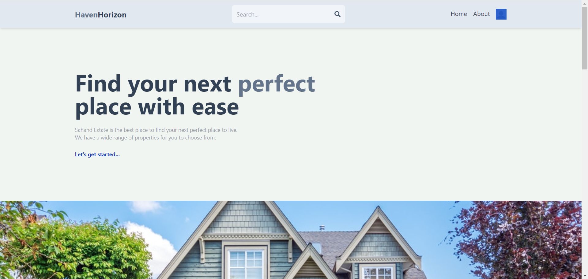
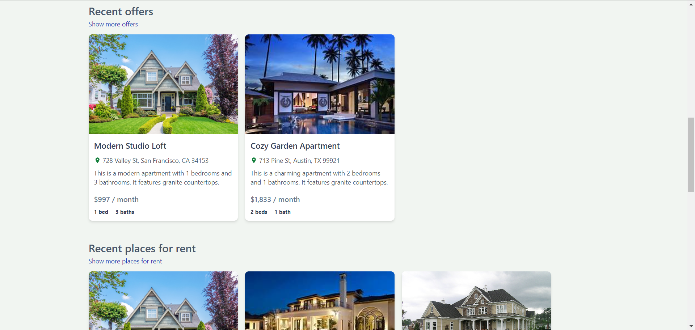
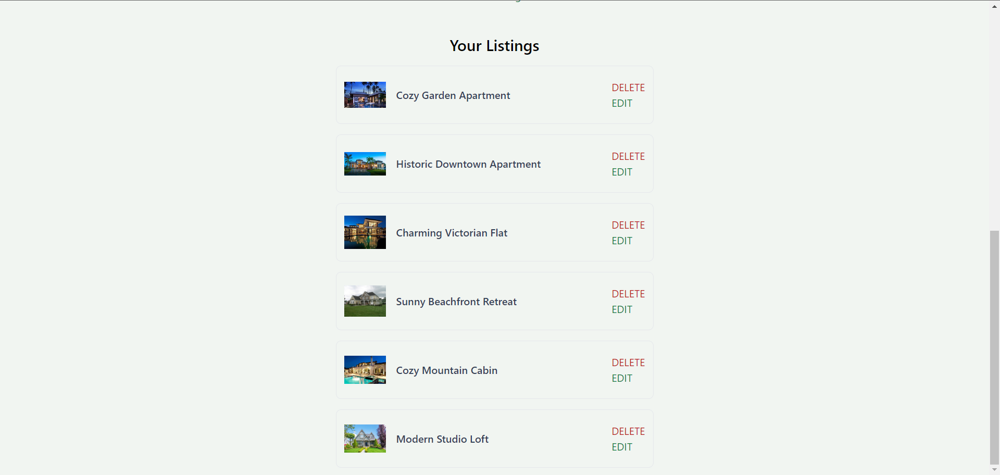
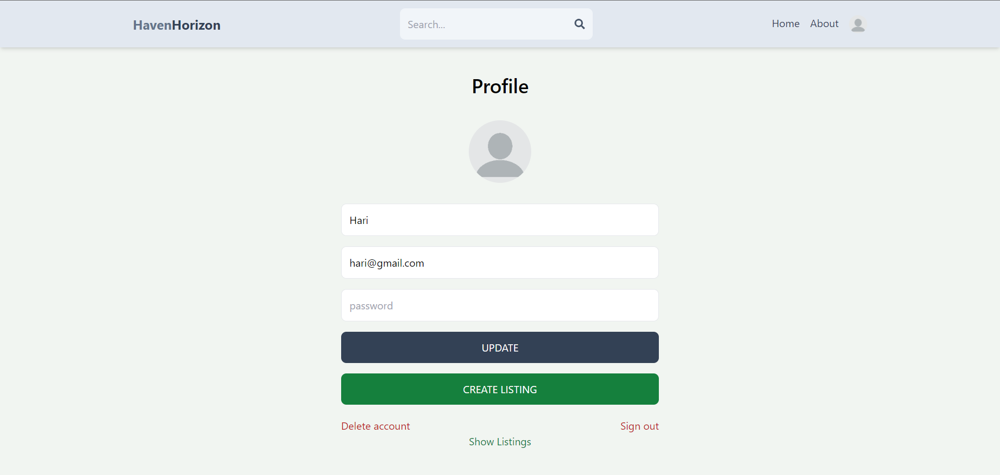
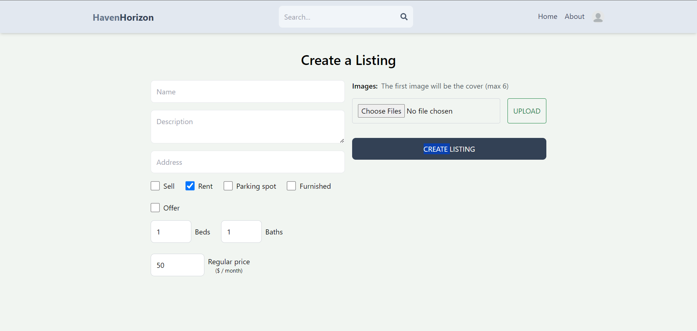

## About the Project

I developed a comprehensive real estate platform designed to make property searching, buying, and selling a seamless experience. Our goal is to connect buyers with their ideal properties while providing sellers with a user-friendly platform to list their properties.

## Features

- Property Listings: Browse a wide variety of properties.
- Advanced Search: Filter properties by location, price, size, and more.
- Property Details: View detailed information and high-quality images for each property.
- User Accounts: Create an account to save favorite properties and receive notifications.
- Contact Agents: Directly contact property agents for more information.

## Screenshots

# API Template

## Base URL

[https://estatebackend-yojy.onrender.com/](https://estatebackend-yojy.onrender.com/)

## END POINTS

#### Test

[Test Link](https://estatebackend-yojy.onrender.com/api/user/test)

#### SignUp / Register
POST / [/api/auth/signup](https://estatebackend-yojy.onrender.com/api/auth/signup)

#### Signin
POST / [/api/auth/signin](https://estatebackend-yojy.onrender.com/api/auth/signin)

#### Google Account
POST / [/api/auth/google](https://estatebackend-yojy.onrender.com/api/auth/google)

#### Signout
GET / [/api/auth/signout](https://estatebackend-yojy.onrender.com/api/auth/signout)

### User EndPoints

#### Update User Details
POST / [api/user/update/:id](https://estatebackend-yojy.onrender.com/api/user/update/:id)

#### Delete User
DELETE / [api/user/delete/:id](https://estatebackend-yojy.onrender.com/api/user/delete/:id)

#### Get Listing of specified User
GET / [api/user/listings/:id](https://estatebackend-yojy.onrender.com/api/user/listings/:id)

#### Get User
GET / [api/user/:id](https://estatebackend-yojy.onrender.com/api/user/:id)

### Listing EndPoints
#### Created a new Lisiting
POST / [/api/listing/create](https://estatebackend-yojy.onrender.com/api/listing/create)
#### Delete a Specific Listing
DELETE / [/api/listing//delete/:id](https://estatebackend-yojy.onrender.com/api/listing//delete/:id)
#### Update a Listing
POST / [api/listing/update/:id](https://estatebackend-yojy.onrender.com/api/listing//delete/:id)
#### Get Specific Lisitng
GET / [api/listing/get/:id](https://estatebackend-yojy.onrender.com/api/listing/get/:id)
#### Get All Listings
GET / [api/listing/get](https://estatebackend-yojy.onrender.com/api/listing/get)

